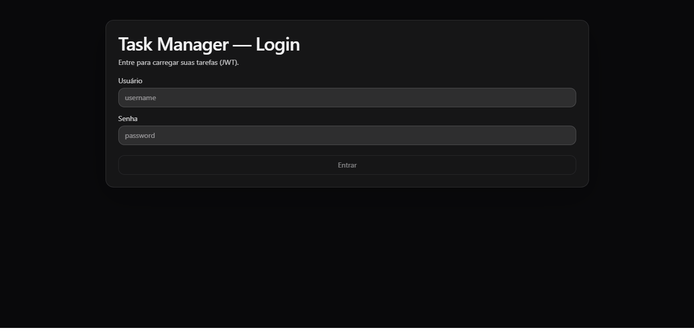
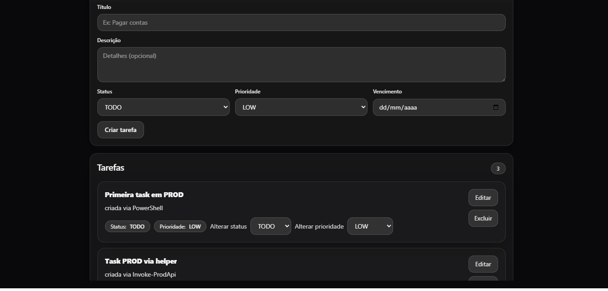
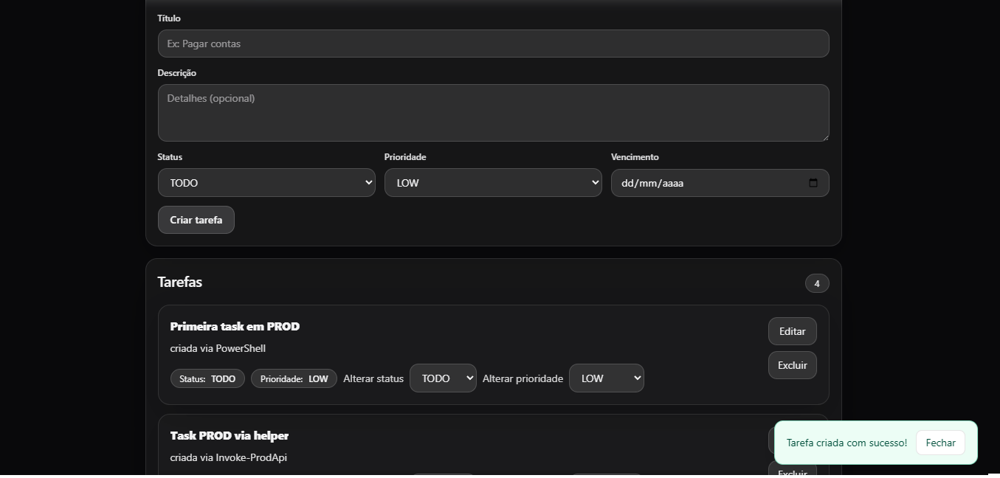
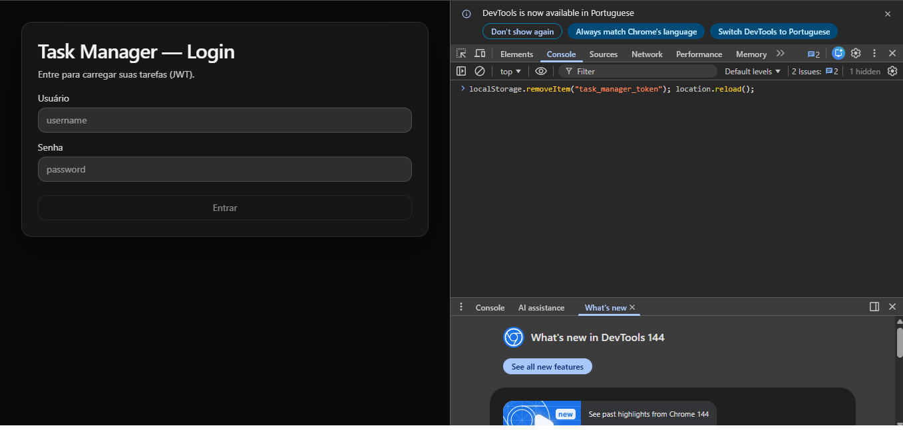
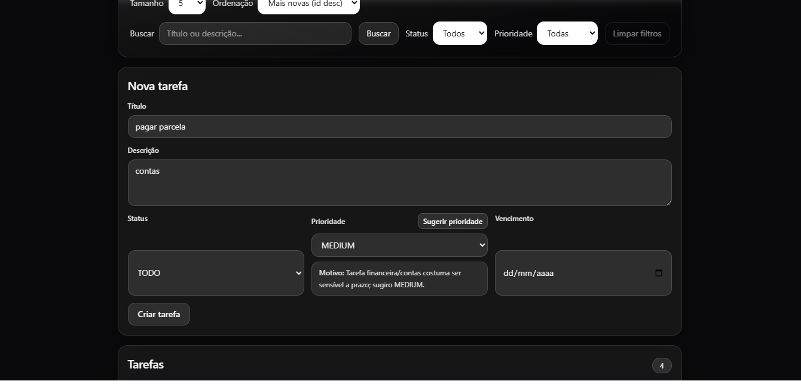

# Task Manager — Full Stack (V2: JWT + Scaling + Observability + AI)

This is the frontend of my Task Manager project, which is my main full-stack portfolio project.

I built this version to connect the React frontend to my Spring Boot API with JWT authentication, improve the user experience, and demonstrate a complete flow running in production.

- **Backend:** Java 21 · Spring Boot · PostgreSQL · Flyway · Actuator  
- **Frontend:** React · Vite · TypeScript · Tailwind CSS  
- **Production(current setup):** Render (API) + GitHub Pages (Frontend)

---

## Live Demo (Production)

- **Frontend (GitHub Pages):** https://gustavomprado.github.io/task-manager-frontend/
- **API (Render):** https://task-manager-api-njza.onrender.com  
  - Health: https://task-manager-api-njza.onrender.com/actuator/health  
  - Root status: https://task-manager-api-njza.onrender.com/  
    - Returns: `{"status":"ok","service":"task-manager-api"}`

> **Note (Render free tier)**: If the API stays idle for some time, the first request may take longer **(cold start, usually around 30s to 60s)**. The API stays on Render, and the production PostgreSQL database was migrated to **Neon** to avoid Render Free Postgres expiration while keeping the same public API URL.

---

## V2 Highlights (Security + Resilience + AI)
In V2, I focused on making the frontend work better with the secured backend (JWT), improving resilience/UX, and adding the AI priority suggestion flow.

### AI — Priority suggestion (JWT-protected)
- Button **"Sugerir prioridade"** in the task form calls `POST /ai/suggest-priority`
- Payload: `{ title, description }`
- Response: `{ priority, reason }`
- The form auto-fills **priority** and displays the **reason**
- I kept the backend AI endpoint usable in demo mode (deterministic mock) when \OPENAI_API_KEY` is not set, so the feature still works in portfolio demos`

### JWT Auth (Frontend + Backend)
- Login via `POST /auth/login` returns `{ token }`
- The frontend stores the token in localStorage (key: \task_manager_token`)`
- Requests to `/tasks/**` use `Authorization: Bearer <token>`
- If the API returns **401**, the frontend clears the token and redirects back to login (session expired)

### Resilience / Scaling
- **Login rate limit**: after **5 attempts/minute/IP**, `/auth/login` returns **429**
- **Pagination cap**: requests with very large `size` are capped (e.g., `size=999` → effective `size=50`)
- **Flyway migrations**: schema versioned (includes `V2__add_indexes_timestamps.sql`)

### Observability
- The frontend depends on the backend health endpoint ( + crase + GET /actuator/health + crase + ) for production checks, and it should return + crase + UP + crase + ``

### Security docs / Pentest evidence (Backend)
- Security summary and controls: `SECURITY.md` (backend repo)
- Controlled local pentest report (Kali): `docs/PENTEST.md` (backend repo)
- Pentest evidence files: `docs/pentest-evidencias/` (backend repo)

---

## Features

- **Full CRUD:** create, list (paginated), get by id, update (PUT), partial update (PATCH), delete
- **List UI:** pagination, search (`q`), filters (status/priority), sorting, page size
- **Inline updates:** PATCH **status** and **priority** directly from the list
- **UX:** loading overlay, toast feedback, friendly error messages
- **Security UX:** login screen, protected routes, session-expired handling (401)
- **AI UX:** one-click priority suggestion with explanation (reason)

---

## Quick start (Local)

### Option 1 — Frontend + Backend (two terminals)

**Terminal 1 (Backend):**
```powershell
cd C:\workspace\springboot-api
docker compose up -d --build
```

Expected result:
- Containers `api` and `postgres` start successfully
- API at `http://localhost:8081`

**Terminal 2 (Frontend):**
```powershell
cd C:\workspace\task-manager-frontend
npm install
npm run dev
```

Expected result:
- Vite dev server at `http://localhost:5173`

---

## Configuration

### Production API URL
In production, this frontend uses \VITE_API_URL` to call the backend API.`

- `.env.production`:
  - `VITE_API_URL=https://task-manager-api-njza.onrender.com`

### Dev proxy
In development, the frontend calls `/api/...` and Vite proxies it to `http://localhost:8081` (and strips the `/api` prefix).

---

## JWT Flow (How I test it in production)

1) Open the frontend:
- https://gustavomprado.github.io/task-manager-frontend/

2) Login
- The app should authenticate, store the token, and load the task list.

3) Validate protected behavior
- Missing or invalid token → the app returns to login
- If the API returns 401, the token is cleared and the app redirects back to login.

---

## Screenshots (V2)







---

## Repositories

- Backend: https://github.com/GustavoMPrado/task-manager-api
- Frontend: https://github.com/GustavoMPrado/task-manager-frontend

---

## Contact

Gustavo Marinho Prado Alves  
GitHub: https://github.com/GustavoMPrado
Email: gmarinhoprado@gmail.com


