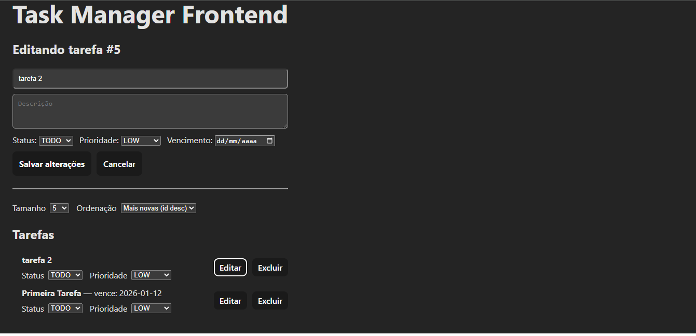

# Task Manager Frontend (React + Vite)

Frontend do sistema **Task Manager**, consumindo uma **API REST real** (Spring Boot) via HTTP.
## Backend (API)
- Repository: https://github.com/GustavoMPrado/task-manager-api

## Stack
- React + Vite
- JavaScript (ES6+)
- Axios
- CSS simples (sem frameworks)

## Funcionalidades
- Listagem de tarefas com paginação
- Criar tarefa (POST)
- Editar tarefa (PUT) via modo edição no formulário
- Atualização parcial (PATCH) direto na lista:
  - alterar **status**
  - alterar **prioridade**
- Excluir tarefa (DELETE) com confirmação
- Loading e mensagens de erro

## Screenshots




## Como rodar
### Pré-requisitos
- Node.js (LTS)
- API rodando localmente

### Instalação
```bash
npm install
npm run dev


