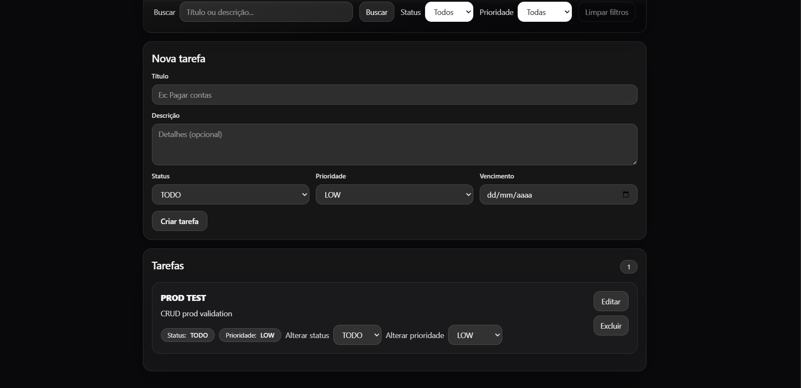
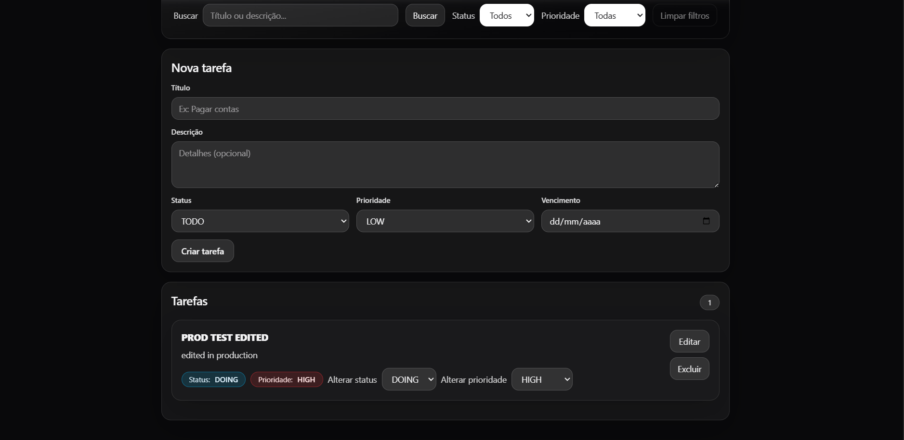
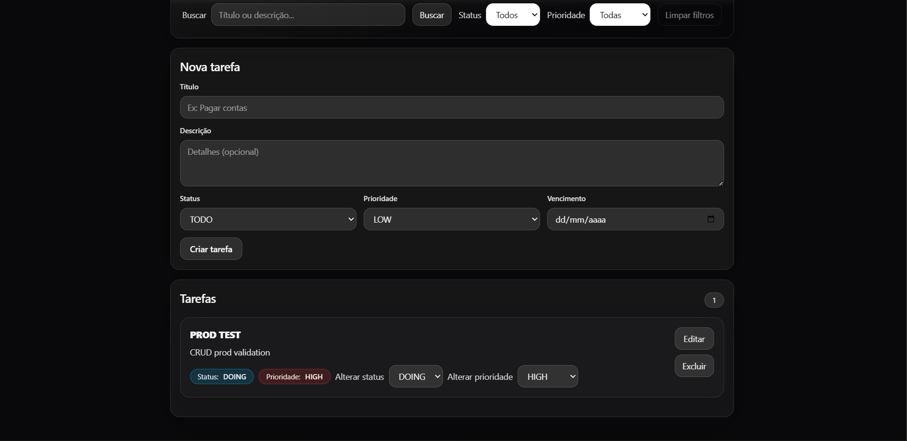
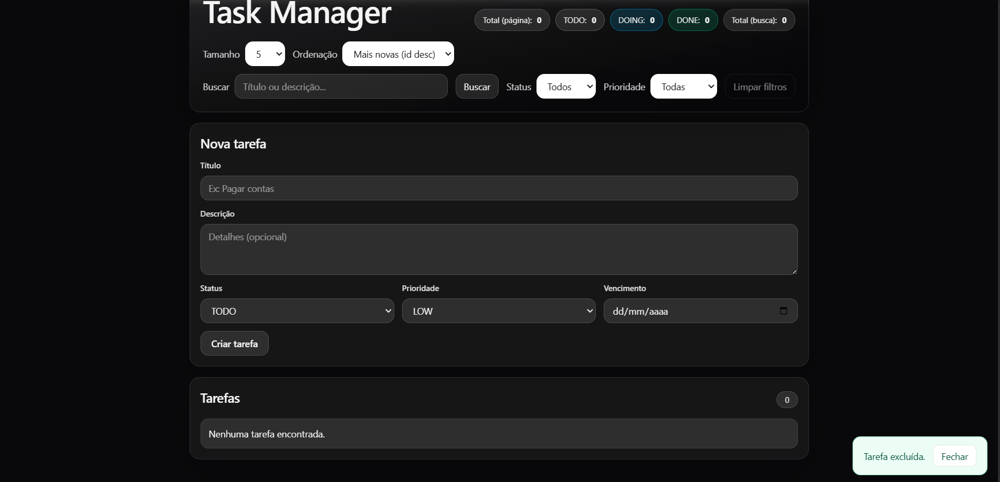
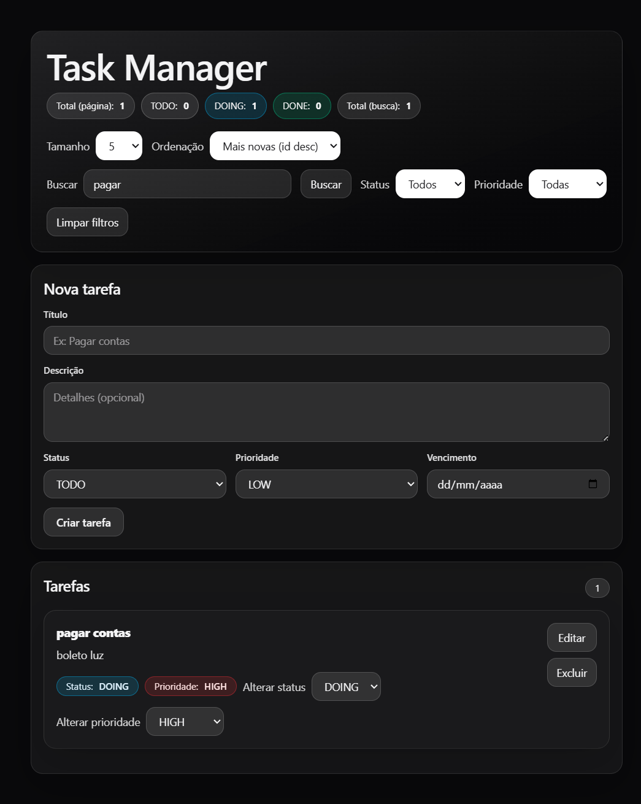

# Task Manager — Full Stack (Java + Spring Boot + React)

A full-stack **Task Manager** portfolio project showcasing real-world **CRUD**, **pagination**, **filters/search**, and a clean **UX**.

- **Backend:** Java 21 · Spring Boot · PostgreSQL · Flyway  
- **Frontend:** React · Vite · TypeScript · Tailwind CSS  
- **Production:** Render (API) + GitHub Pages (Frontend)  
- **Local run:** Docker Compose **or** Windows scripts (two clicks)

---

## Live Demo (Production)

- **Frontend (GitHub Pages):** https://gustavomprado.github.io/task-manager-frontend/
- **API (Render):** https://task-manager-api-njza.onrender.com  
  - Health: https://task-manager-api-njza.onrender.com/actuator/health  
  - Tasks (example): https://task-manager-api-njza.onrender.com/tasks?page=0&size=5&sort=id,desc

> **Note:** Render Free may have a **cold start** (~50s) on the first request.

---

## Features

- **Full CRUD:** create, list (paginated), get by id, update (PUT), partial update (PATCH), delete
- **List UI:** pagination, search (`q`), filters (status/priority), sorting, page size
- **Inline updates:** PATCH **status** and **priority** directly from the list
- **UX:** loading overlay, toast feedback, friendly error messages
- **Dev-friendly local run:** run locally via Docker Compose or `.bat` scripts

---

## Quick start (Local)

### Option 1 — One command (Docker Compose)

From the folder where `docker-compose.yml` is located:

~~~bash
docker compose up --build
~~~

Open:
- Frontend: http://localhost:5173
- API: http://localhost:8081

To stop:

~~~bash
docker compose down
~~~

### Option 2 — Two clicks (Windows)

In this frontend folder:

1. Double click: `start-task-manager.bat`
2. Open: http://localhost:5173

To stop:
- Double click: `stop-task-manager.bat`

---

## Configuration

### Production API URL

This repo uses `VITE_API_URL` in production.

- `.env.production` (versioned):
  - `VITE_API_URL=https://task-manager-api-njza.onrender.com`

### Dev proxy

In development, the frontend calls `/api/...` and Vite proxies to `http://localhost:8081` (removing `/api`).

---

## What you can do (UI)

- Create tasks with title, description, status, priority, and due date
- Browse tasks with pagination
- Search by text using `q` and filter by status/priority
- Sort by fields (e.g., `id`, `title`, `dueDate`) and change page size
- Edit tasks (PUT) using form edit mode
- Delete tasks with confirmation
- Update status/priority (PATCH) directly from the list

---

## 📸 Screenshots (Production)

### List (PROD)

### Edit (PROD)

### Filters / Pagination (PROD)

### Delete Toast (PROD)

---

## 📸 Screenshots (Dev)

### Home (DEV)

### Filters / Search (DEV)

### Edit / Patch (DEV)

---

## Repositories

- Backend: https://github.com/GustavoMPrado/task-manager-api
- Frontend: https://github.com/GustavoMPrado/task-manager-frontend

---

## Contact

Gustavo Marinho Prado Alves  
GitHub: https://github.com/GustavoMPrado

